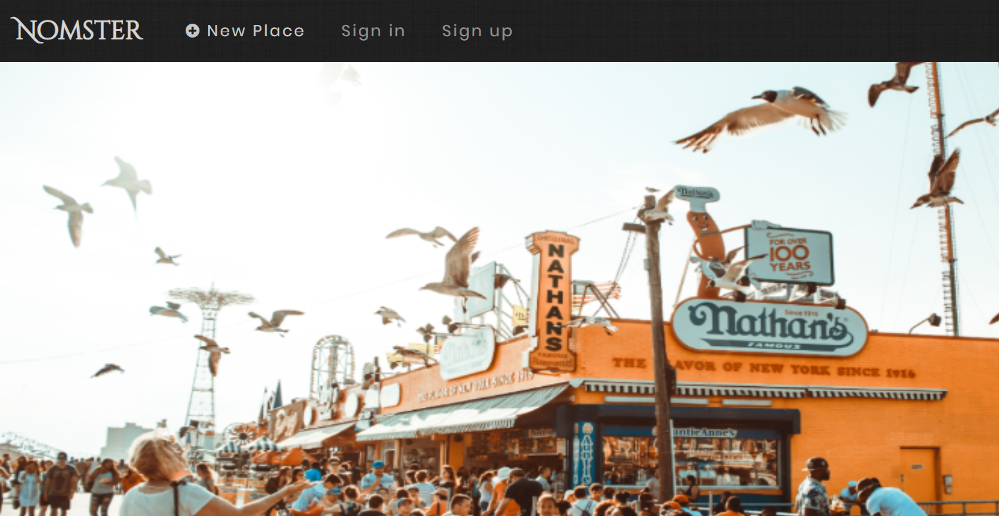
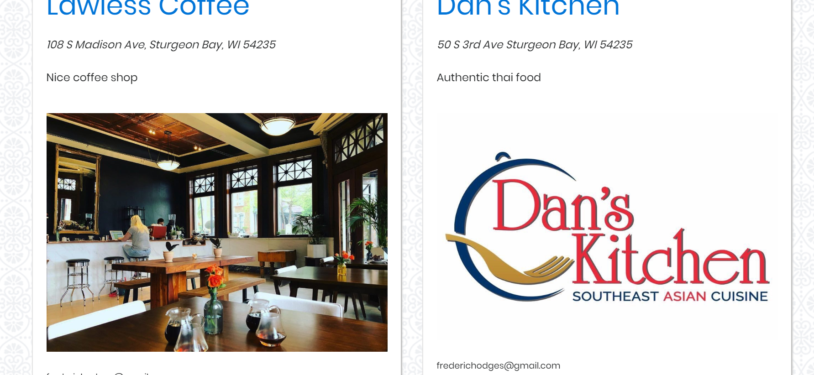

# Documentation

## What this app is:

A Yelp clone that integrates with the Google Maps API and includes features like user comments, star ratings, image uploading, and user authentication.

You may visit the deployed version [here](https://nomster-frederic-hodges.herokuapp.com/).

***
# Setup

## Prerequisites:
 
 The following tools should be installed on the system before following setup steps.
 
  - Git
  - Ruby 2.5.3
  - Rails 5.2.3
  
1. **Clone repo:**
       
        git@github.com:derfman9303/nomster.git
        
2. **On the command line, navigate to the grammable repository**
        
        cd nomster

3. **Create the database**
        
        rails db:create db:migrate
        
4. **Install gems**
        
        bundle install

***
# Usage

## Start your server:

        rails server -b 0.0.0.0 -p 3000

You may now visit your app at http://localhost:3030

***
# Deployment

## Pushing to Heroku

If you would like, you may push your app up to Heroku by running the following commands:

        git init
        
        git add .
        
        git commit -am "initial commit"
        
        heroku create
        
        git push heroku master
 
 ***
# Notes
This app integrates with Google maps API. For more information, visit the official documentation

